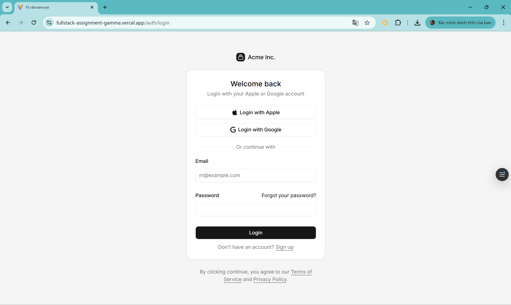
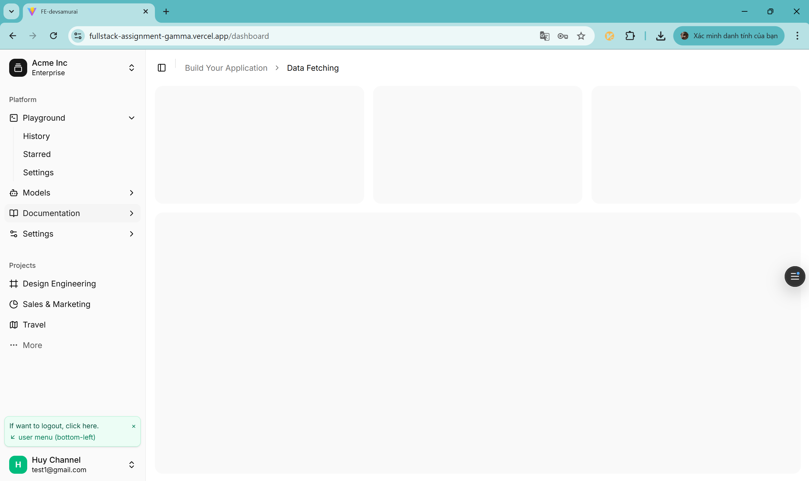
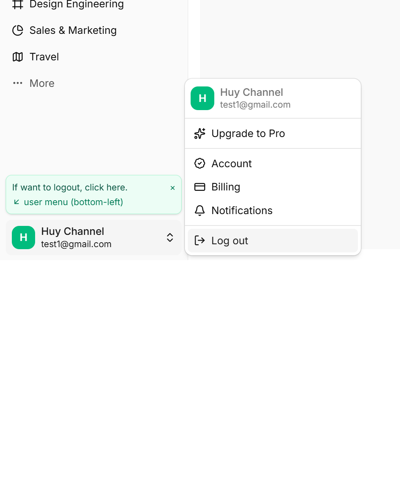
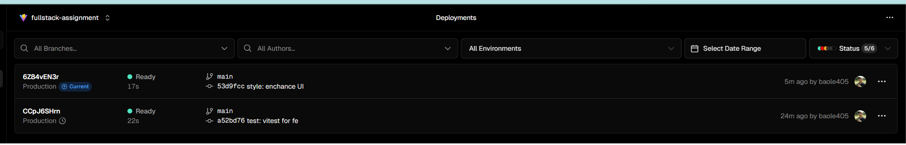
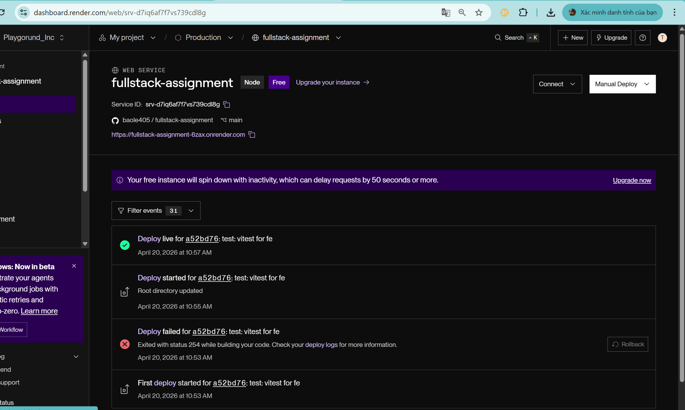
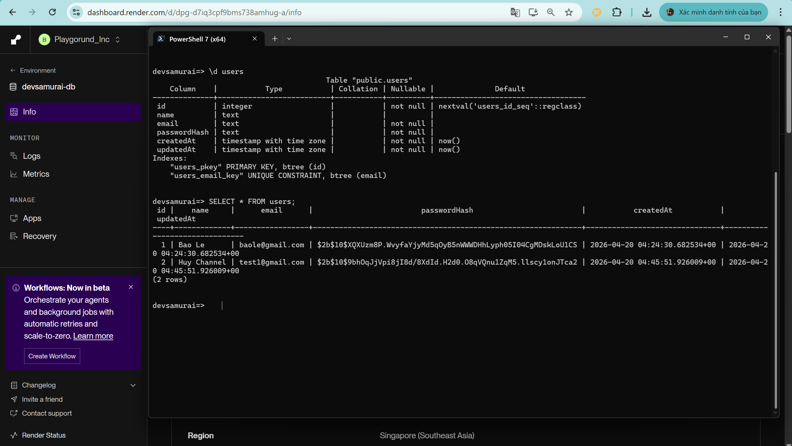

# Fullstack Assignment

Practice task implementation with React frontend and Express backend.

## Tech Stack

- Frontend: React (Vite), Tailwind CSS, shadcn/ui, React Hook Form, Zod, Redux Toolkit, React Router, TanStack Query
- Backend: Node.js, Express, TypeScript, Sequelize, PostgreSQL, JWT, bcrypt
- Testing: Vitest + Supertest (backend), Vitest + Testing Library (frontend)

## Project Structure

- `be`: Express API server
- `fe`: React web app

## Prerequisites

- Node.js 20+
- pnpm 10+ (for frontend)
- npm (for backend scripts)
- Docker Desktop (for PostgreSQL)

## Setup Instructions

### 1) Start Database

Run PostgreSQL from Docker Compose:

1. Go to `be`
2. Run `docker compose up -d`

Default local mapping is `localhost:8080` to PostgreSQL container port `5432`.

### 2) Run Backend

1. Go to `be`
2. Install dependencies: `npm install`
3. Start dev server: `npm run dev`

Backend runs at `http://localhost:5000`.

Useful backend commands:

- `npm run test`
- `npm run build`

### 3) Run Frontend

1. Go to `fe`
2. Install dependencies: `pnpm install`
3. Start dev server: `pnpm dev`

Frontend runs at Vite default URL (usually `http://localhost:5173`).

Useful frontend commands:

- `pnpm test`
- `pnpm typecheck`
- `pnpm build`

## Implemented Features

- Authentication flow:
  - Sign up
  - Sign in
  - JWT-protected profile check (`/auth/me`)
- Route behavior:
  - `/` redirects to `/auth/signup`
  - Legacy `/signin` redirects to `/auth/login`
  - `/me` redirects to `/auth/login`
  - Successful login or signup navigates to `/dashboard`
- Dashboard UI with sidebar and user menu
- Validation with React Hook Form + Zod
- Global auth state with Redux Toolkit
- Basic test readiness with `data-testid` on key buttons:
  - `login-btn`
  - `create-btn`

## API Endpoints

- `POST /auth/signup`
- `POST /auth/login`
- `GET /auth/me` (requires Bearer token)

## Assumptions And Trade-offs

- Auth session is persisted in `localStorage` for assignment simplicity.
- Password reset and social login buttons are UI-only placeholders.
- Current auth verification uses existing JWT and backend `/auth/me`; no refresh-token flow yet.
- Frontend uses manual fetch wrappers for auth APIs; TanStack Query is set up in app providers for future data-fetching expansion.
- Test coverage focuses on critical assignment smoke paths rather than exhaustive integration suites.

## Screenshots

- FE Login page: 
- FE Signup page: 
- FE Dashboard page: 
- FE Logout menu and helper hint: 
- Vercel deployments status: 
- Render backend service status: 
- PostgreSQL users table verification: 

## Live Deployment

- Frontend (Vercel): https://fullstack-assignment-gamma.vercel.app
- Backend API (Render): https://fullstack-assignment-6zax.onrender.com

